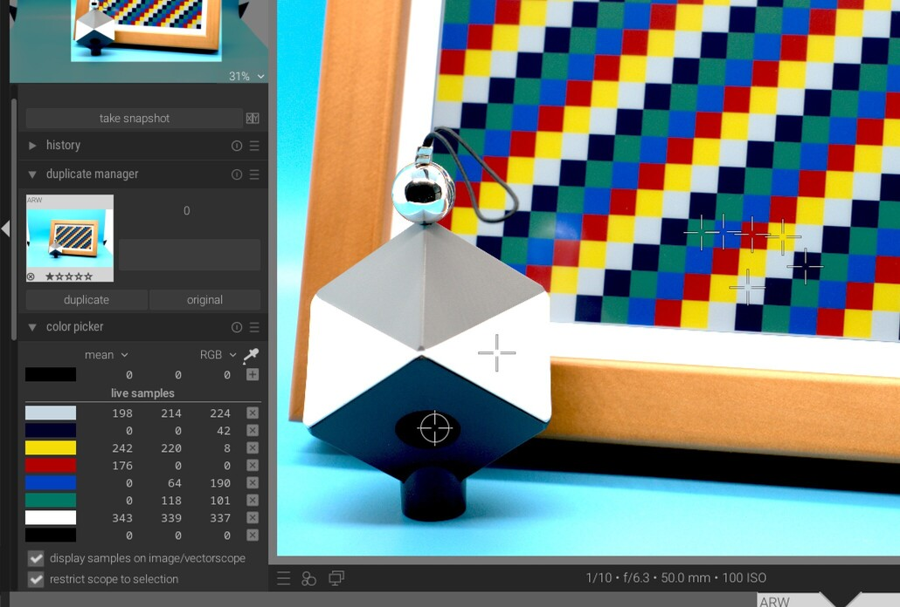
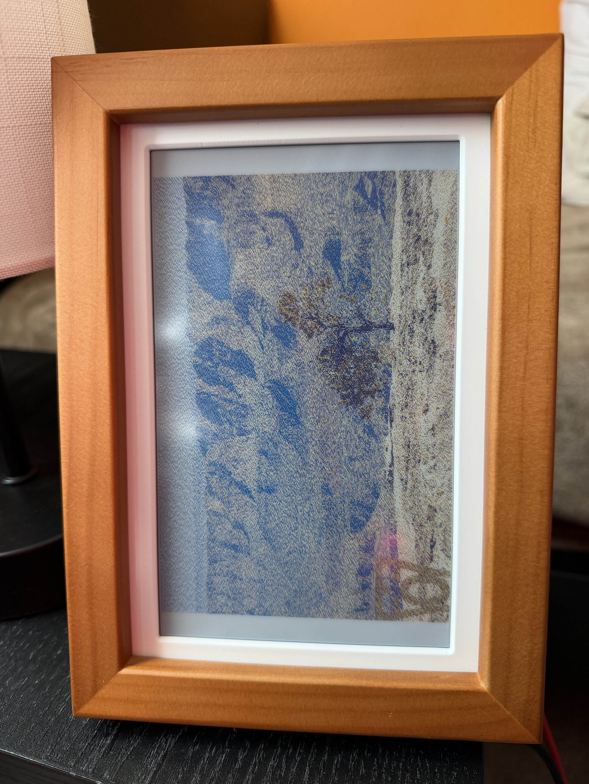
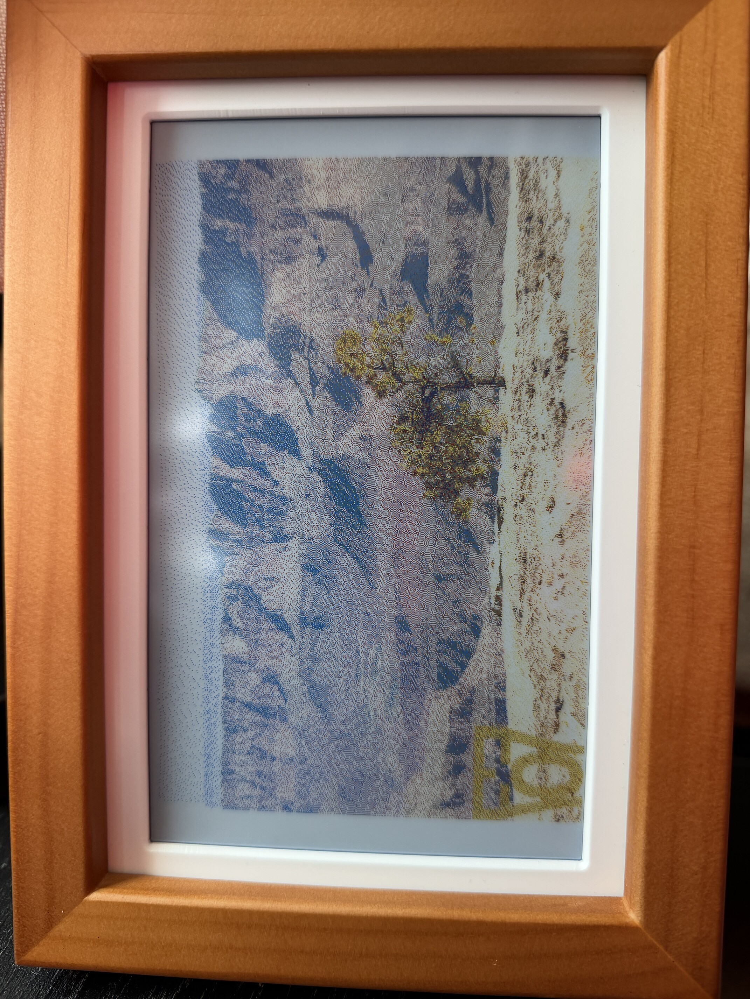

# Dithering Colors

The default Waveshare dithering code uses a ideal color for the e-ink palette, so 0xFF0000 for red, 0xFFFF00 for yellow, etc.

Due to the e-ink technology, and because the color is not an emitting source, the colors are off from their ideal. For example, black is actually a very dark blue, green is actually a dark-green color, and so on.

I decided to see if I can improve on this pallette. I tool a picture of the display with a checkerboard pattern alongside a Spyder Cube color balancer with my SLR, imported in Darktable, and proved the 6 color values.

There is some heuristics I had to do, mainly in the exposure of the image. As the display doesn't emit light on it's own, the perceived colors will depend on the lighting environment it's in. I tried to set the exposure so it's similar to a brightly lit room.

With a test image, below is a before-and-after comparison of the pure color pallette and my version. I think my version better represents the color on the input image on the display

| Default Dithering Colors | My Dithering Colors|
| ---|---|
|  |  |

The pallette color used are in [my imageProcessor.py file](/imageBuilder/imageProcessor.py)